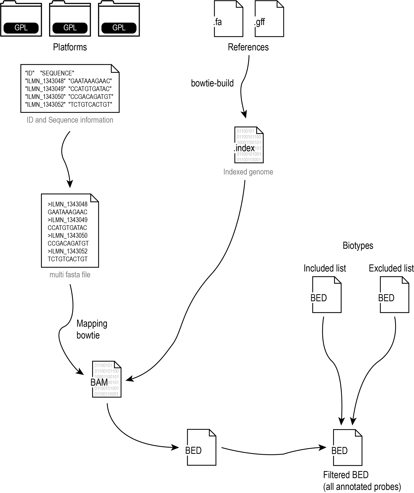

# reannotator_microarray_probes pipeline

Pipeline for microarray probes sequence reannotation.

## Summary
1. [Environment preparation](#environment-preparation)
2. [Clone the reannotator GitHub repository](#clone-the-reannotator-github-repository)
3. [Prepare the human genome sequence and mapper index](#prepare-the-human-genome-sequence-and-mapper-index)
4. [Change the reference genome](#change-the-reference-genome)
5. [Prepare GPL sequence file](#prepare-gpl-sequence-file)
6. [To start all processes to reannotation of each probe, execute the pipeline](#to-start-all-processes-to-reannotation-of-each-probe,-execute-the-pipeline)

## Workflow


## Environment preparation

### In your command line Terminal, download the Miniconda installer:
```
cd <specify a directory path>
wget -O Miniconda3.sh https://repo.anaconda.com/miniconda/Miniconda3-latest-Linux-x86_64.sh
```
or you can use the curl command line
```
curl -sL \
  "https://repo.anaconda.com/miniconda/Miniconda3-latest-Linux-x86_64.sh" > \
  "Miniconda3.sh"
```

### Install the Miniconda by the command line:
```
bash Miniconda3.sh
```

### Miniconda3 installation process
```
Welcome to Miniconda3 py38_4.9.2

In order to continue the installation process, please review the license
agreement.
Please press ENTER to continue.
>>>

Do you accept the license terms? [yes|no]
[no] >>> yes

Miniconda3 will now be installed into this location:
/root/miniconda3

  - Press ENTER to confirm the location
  - Press CTRL-C to abort the installation
  - Or specify a different location below

[/root/miniconda3] >>> 
PREFIX=<Define your directory here! or enter to keep /root/miniconda3 directory>

Do you wish the installer to initialize Miniconda3
by running conda init? [yes|no]
[no] >>> yes
```

### After Miniconda3 installation, delete the installer file:
```
rm Miniconda3.sh
```

**Important!!!** Close and reopen your terminal to activate the Conda base environment.


### Update Conda using the command line:
```
conda update conda
```

### Finally, install the programs wget and git using the Conda command:
```
conda install git
conda install wget
```

## Clone the reannotator GitHub repository
```
git clone https://github.com/csbl-usp/reannotator-microarray-probes.git
```

### Entry on the source directory it contains all scripts
```
cd reannotator-microarray-probes/src/
```

### Change the file permission for "execution" mode
```
chmod 755 *
```

### Build the conda environment for all required packages for the pipeline
```
conda env create --file ../parameters/reannotator_env.yml
conda activate reannotator
```
**Important!!!** Make sure the reannotator environment are actived or execute the command 'conda activate reannotator' for it.


## Prepare the human genome sequence and mapper index
### Build a human genome directory
```
./createReferenceDirectory
```

The reference genome used for this pipeline is release-103 from ENSEMBL database.

## Change the reference genome
### Open the create database folders
Edit the script file src/createReferenceDirectory, and modify these lines:
```
...
# You can change it to any string. Just avoid starting with numbers and the string containing spaces
alias=hsapiens

...

# Change all occurences of 'Homo_sapiens' for your reference genome.
touch $dbdir/genome/fa/Homo_sapiens_chrs.fa
for i in 1 2 3 4 5 6 7 8 9 10 11 12 13 14 15 16 17 18 19 20 21 22 X Y MT
  do
	  wget -O $dbdir/genome/fa/Homo_sapiens_chr${i}.fa.gz http://ftp.ensembl.org/pub/release-103/fasta/homo_sapiens/dna/Homo_sapiens.GRCh38.dna_sm.chromosome.${i}.fa.gz
		gunzip $dbdir/genome/fa/Homo_sapiens_chr${i}.fa.gz
		cat $dbdir/genome/fa/Homo_sapiens_chr${i}.fa >> $dbdir/genome/fa/Homo_sapiens_chrs.fa
		rm $dbdir/genome/fa/Homo_sapiens_chr${i}.fa
  done

	cd $dbdir/genome/fa/
	ln -s Homo_sapiens_chrs.fa ${alias}.fa

...

# Change all occurences of 'Homo_sapiens' for your reference genome.
wget -O $dbdir/annotation/Homo_sapiens.gff.gz http://ftp.ensembl.org/pub/release-103/gff3/homo_sapiens/Homo_sapiens.GRCh38.103.chr.gff3.gz
gunzip $dbdir/annotation/Homo_sapiens.gff.gz
cd $dbdir/annotation
ln -s Homo_sapiens.gff ${alias}.gff
```

**Under construction** How to change the human reference genome for new or old versions.

## Prepare GPL sequence file
Show a platform structure with a tree command:
```
tree ../platforms/
```

Strutucure of GPL directory.
```
../platforms/
|-- GPL10558
|   |-- probe_sequence.tsv
|-- GPL13287
|   |-- probe_sequence.tsv
|-- GPL13497
|   |-- probe_sequence.tsv
```

The content of probe_sequence.tsv should be "ID" and "SEQUENCE" columns.
```
head ../platforms/GPL10558/probe_sequence.tsv
```
```
"ID"    "SEQUENCE"
"ILMN_1343048"  "GAATAAAGAACAATCTGCTGATGATCCCTCCGTGGATCTGATTCGTGTAA"
"ILMN_1343049"  "CCATGTGATACGAGGGCGCGTAGTTTGCATTATCGTTTTTATCGTTTCAA"
"ILMN_1343050"  "CCGACAGATGTATGTAAGGCCAACGTGCTCAAATCTTCATACAGAAAGAT"
"ILMN_1343052"  "TCTGTCACTGTCAGGAAAGTGGTAAAACTGCAACTCAATTACTGCAATGC"
"ILMN_1343059"  "CTTGTGCCTGAGCTGTCAAAAGTAGAGCACGTCGCCGAGATGAAGGGCGC"
"ILMN_1343061"  "AATTAAAACGATGCACTCAGGGTTTAGCGCGTAGACGTATTGCATTATGC"
"ILMN_1343062"  "GAAGCATTCAGAGCAAATGAGGCAGCGTTGGTGTAGCACGATAATAATAT"
"ILMN_1343063"  "CGGACGTTATGATTTACCGTGGAAAGATTTGTGAAGTGTTCTGAATGCTC"
"ILMN_1343064"  "GCCCCGTATTCAGTGTGGCTGATTTGTATTGTCAGAAGTTGTTTTTACGT"
```

Based on the existent platforms directories, create a new directory for the new platforms.

## To start all processes to reannotation of each probe, execute the pipeline
```
./pipeline
```

## The results of output Reannotation are stored in all_annotated_probes.tsv file!
```
head ../results/all_annotated_probes.tsv
```
```
ProbeID Symbol  EnsemblIDs      Biotypes2       Biotypes1       Symbols
ILMN_1799969    SNAPIN  ENSG00000143553|ENST00000462880 protein_coding|processed_transcript     gene|lnc_RNA    SNAPIN|SNAPIN-202
ILMN_1783231    PLEKHB1 ENSG00000021300|ENST00000426191|ENST00000544282 protein_coding|retained_intron|processed_transcript     gene|lnc_RNA|lnc_RNA >
ILMN_1745398    PCDH15  ENST00000463095|ENSG00000150275 processed_transcript|protein_coding     lnc_RNA|gene    PCDH15-218|PCDH15
ILMN_2072091    HNRNPUL2        ENSG00000234857|ENSG00000214753 protein_coding|protein_coding   gene|gene       HNRNPUL2-BSCL2|HNRNPUL2
ILMN_1737738    NDUFA12 ENSG00000184752 protein_coding  gene    NDUFA12
ILMN_1668194    LMTK3   ENSG00000142235 protein_coding  gene    LMTK3
ILMN_1734542    OVGP1   ENSG00000085465 protein_coding  gene    OVGP1
ILMN_1672623    LRRC77P ENST00000481578|ENST00000459923 processed_transcript|processed_transcript       lnc_RNA|lnc_RNA LRRC77P-206|LRRC77P-201
ILMN_1666200    SHLD2   ENSG00000122376 protein_coding  gene    SHLD2
```
## Cleaning result to execute the pipeline again!!
If you need to execute the pipeline for the same platforms, you need to execute the cleaner script before:

```
./cleaner
```
If you add new platforms after any execution, the pipeline will analyze the new platform only.


# Use the Docker image for reannotator pipeline

## Docker installation

Access the website https://www.docker.com/get-started to install the docker program in Windows, MacOS or Linux systems.

## Download the reannotator image from the Docker hub. Access the terminal and execute the command line.
```
$ docker pull csblusp/reannotator
```

## For Linux and MacOS

### Create a Docker container for reannotator image
```
docker run -d -it --rm --name reannotator [-v <put your directory path here!>:/home] csblusp/reannotator
```
-v corresponds to the volumes parameter to link the local directory to the container directory and access/download files from the Docker container. Check out more details at the Docker volumes website: https://docs.docker.com/storage/volumes/

### Entry on the Docker container of reannotator
```
docker exec -it reannotator bash
```

### Entry on the reannotator pipeline directory
```
cd /home/reannotator_microarray_probes
git pull

cd /home/reannotator_microarray_probes/src
conda activate reannotator
```

Execute the same steps from the [Prepare human genome sequence and mapper index](#prepare-human-genome-sequence-and-mapper-index)


## For Windows system
Under construction
